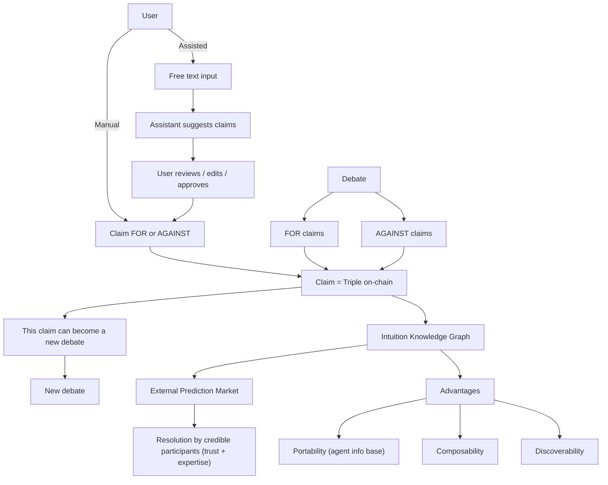

# Overview — Debate Market

## Context

Today, online debates appear and then dissolve into feeds.  
They repeat endlessly, fail to accumulate shared understanding, and rarely build on each other.  
Nothing is structured. Nothing persists. Nothing improves collectively.

And yet, strong signals around us point toward a different direction:

- **Kialo** shows that debate can be structured into branches of supporting and opposing arguments —  
  but the reasoning remains locked inside a single platform, without incentives, portability, or compounding.

- The recent **Polymarket × Twitter** momentum demonstrates that when beliefs are expressed publicly, tested over time, and tied to skin in the game,  
  a clearer signal emerges.  
  A strong validation that **debate + market incentives + visibility** outperform ephemeral opinion feeds.

- Tools like **Claimify (Microsoft)** reveal a parallel shift: extracting claims from unstructured conversation.  
  A push toward turning discourse into machine-readable meaning — but still siloed, without a shared graph or incentive layer.

Three forces are converging:

- Structuring arguments (Kialo)  
- Surfacing belief signals (Polymarket)  
- Extracting claims from discussion (Claimify)

Yet today, they remain **fragmented, ephemeral, and platform-bound**.

This project explores a different path:

> **Turn debate into structured, reusable reasoning.**

Each contribution enriches a shared and portable memory instead of disappearing in a scroll.  
Every argument can become a new discussion, a durable signal, and a node in a living graph.

Instead of disposable debates, a **mental infrastructure** where ideas breathe, evolve, and connect —  
supporting collective sense-making that does not vanish.

---

## Core concept

- A debate starts with a **clear assertion**
- Participants add claims **for** or **against**
- A debate can also be opened **without taking a position** at first
- **Each claim = a triple on-chain** (Subject → Predicate → Object)
- Any claim can become the starting point for a new debate
- Reasoning grows **recursively**, not linearly

---

## User experience

Users see:

- The initial assertion
- For-claims and against-claims
- Deeper levels of responses and justifications
- A structured reasoning map rather than a scrolling feed

The interface encourages clarity and connection, not reaction.

---

## How it works

- A claim is directly stored **as a semantic triple**
- The system records relationships of meaning, not just text
- Arguments accumulate and connect across debates
- The result is a shared, navigable memory of reasoning

Debate becomes **a growing structure of thought**, not an ephemeral thread.

---

## Contribution modes

### Manual mode
Write claims directly and assign them as **for** or **against**.

### Assisted mode
Write naturally; the system helps transform free text into structured claims:

1. User types an argument in natural language  
2. The assistant extracts proposed claims and positions (for/against)  
3. The user reviews, edits, approves, or rejects each suggestion  
4. Approved claims are saved as triples  

The assistant helps organize thoughts — **the human remains the decision-maker**.

---

## What this enables

- Reuse of arguments across debates
- Accumulation of reasoning instead of repeating it
- Visibility on how ideas develop over time
- Emergence of stable reasoning paths or abandoned ones
- Debate becomes **a tool for building knowledge**, not just expressing opinion

---

## Future directions

For long-term extensions such as prediction layers,  
emergent resolution participants, and AI agents that understand your reasoning style, see:

👉 **[Vision](./vision.md)**

---

## A concrete example:

  <iframe
    style={{border: '1px solid #ddd', borderRadius: '8px'}}
    width="100%"
    height="500"
    src="https://whimsical.com/embed/3T7sNnEitu9E97c7mQai6D"
    allow="fullscreen"
  ></iframe>

